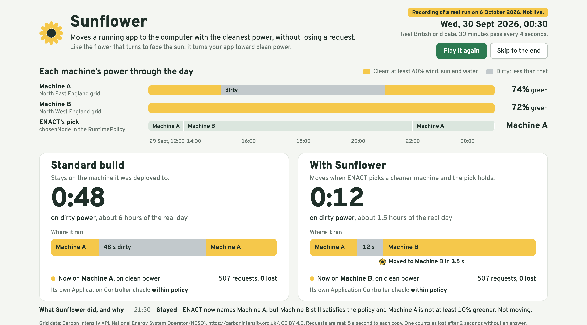

# Sunflower

**GreenCharge tells drivers where the clean power is. Sunflower makes GreenCharge go there itself.**

Veles Hack 2026 · Challenge 3 · ENACT, Kubernetes Dynamic Adaptation



This is one real run on the challenge's three-node ENACT cluster, saved as it was measured
([`docs/demo/run.json`](docs/demo/run.json)). Two copies of GreenCharge get the same traffic.
The green share of each machine comes from a real day of British grid data, replayed at 30
minutes every 4 seconds. Each stitch is one request, in the colour of the machine that
answered it.

| | Standard build | With Sunflower |
|---|---|---|
| Time spent breaking its own green rule | 48 s | 13 s |
| Requests lost | 0 of 515 | 0 of 515 |
| What it did when the power turned dirty | stayed where it was | moved in 4.9 s |

To watch the run play back, serve `docs/demo` and open it:

```bash
python3 -m http.server 8000 --directory docs/demo
```

## The gap

ENACT's policy operator does its job. Given a `RuntimePolicy`, it ranks the nodes and writes
the best one to `status.chosenNode`, and it keeps that answer current: when a node's green
share drops below the policy's minimum, the operator names another node within seconds.

Nothing acts on that answer after the first day. The SDK reads `chosenNode` once, at deploy
time, and pins the Deployment to that node. When the grid changes, the policy says "Machine B"
and the app stays on Machine A, breaking a rule it declared itself. The Deployment does not
even record which policy placed it.

GreenCharge exists to send drivers to the greenest charger. Following the checklist exactly,
it does that from a machine that is no longer green.

## What Sunflower is

A small Kubernetes controller (Go, about 740 lines). A Deployment opts in with one annotation
naming its policy:

```yaml
metadata:
  annotations:
    sunflower.enact.eu/policy: greencharge-sunflower
```

**Sunflower never chooses a machine.** ENACT decides; Sunflower carries the decision out,
with the same pin the SDK uses (`nodeSelector["kubernetes.io/hostname"]`). What it adds is
judgement about when to follow:

| Sunflower will not | Why | Setting |
|---|---|---|
| move for a dip that does not last | grid data flickers | `--settle` |
| leave a machine that still satisfies the policy for one that is barely better | with near-equal nodes the operator's pick switches back and forth (we measured 2 switches in 150 s) | `--margin` |
| move again straight after moving | a move has a cost | `--dwell` |
| move more than a set number of times an hour | a bad feed should not become a storm | `--max-moves-per-hour` |
| stop the old copy before the new one is answering | no lost requests | built in |
| leave a failed move half done | it puts the app back and says so | `--move-timeout` |

Every action is written down in plain words, as a Kubernetes Event and in Sunflower's own log.
That log is the bottom strip of the screen. `--dry-run` reports what it would do and changes
nothing.

The decision is one pure function with 12 unit tests:
[`sunflower/internal/placement/decide.go`](sunflower/internal/placement/decide.go).

## What we measured

Everything below was run on the challenge cluster on a laptop. The raw files are in
[`evidence/`](evidence) and [`docs/demo/`](docs/demo).

| Test | Result |
|---|---|
| Real-data scene (the picture above) | 515 requests to each copy, 0 lost. Standard build 48 s below its green rule; Sunflower 13 s |
| 30 forced moves in a row | all completed; 2,632 requests to the moving copy, 0 lost; median 8.8 s per move, slowest 15.3 s |
| 20 forced moves, quieter machine | all completed; 1,389 requests, 0 lost; median 4.8 s per move |
| Target machine cannot run the app | move undone after the timeout; old copy served throughout; 0 lost |
| Controller killed in the middle of a move | its replacement finished the move from notes on the Deployment; 0 lost |

A request counts as lost if it did not succeed within 2 seconds. Traffic is sent at a fixed
rate that does not slow down when the app does, so a stall shows up as lost requests, not as
fewer requests.

## The challenge checklist

Done through the ENACT SDK in Eclipse, with a screenshot of every screen in
[`evidence/checklist/`](evidence/checklist).

| Brief item | Status | Where |
|---|---|---|
| Policy model: CPU, RAM, latency, power, green mix, region | Done | [`policymodel.yml`](greencharge/src/main/resources/reconciliation/policymodel.yml) |
| Application Controller extension | Done | SDK wizard (screenshots 01, 02); [`adaptation/`](greencharge/src/main/java/eu/enact/greencharge/adaptation), `POST /adaptation/recommendation` |
| Tests pass with `mvn clean test` | Done, 14 tests | includes both cases the brief names: [`AdaptationServiceTest`](greencharge/src/test/java/eu/enact/greencharge/adaptation/AdaptationServiceTest.java) |
| RuntimePolicy: Soft green ≥ 0.6, Hard region `eu-west`, availability 0.9 | Done | SDK wizard (03 to 06); [`greencharge.yaml`](greencharge/.enact/policies/greencharge.yaml) |
| Packaging: Helm chart, image `greencharge:1.0`, port 8080, ingress `greencharge.local` | Done | SDK wizard (07 to 10); [`sdk-packaging/`](greencharge/sdk-packaging), [`sdk-manifests/`](greencharge/sdk-manifests) |
| Deploy with the policy; the operator places the pod | Done | SDK deploy (11 to 18): policy applied, node chosen, Deployment pinned, pod running on it |
| One step through the AI assistant (bonus) | Done | `generate_runtime_policy` (19 to 22). The policy it wrote is valid but dropped two fields we asked for, so the wizard's policy is the one in use; details in the field report |
| Dataspace feed | **Not done yet** | The SDK's Dataspaces step needs a connector address and key that are not in the challenge material; we have asked the mentors ([`docs/mentor-message.md`](docs/mentor-message.md)). The feed itself is wired: GreenCharge reads `carbon.feed.file`, and here that file is written from real public grid data |
| Monitor under a load burst | Done | [`evidence/monitor-grafana-burst.png`](evidence/monitor-grafana-burst.png): traffic, CPU and Kepler's energy estimate for each copy; `deploy/monitor.sh`, `deploy/burst.sh` |

Beyond the brief, the adaptation service also checks the three policy fields the Application
Controller loads but never compares with anything (green energy mix, power ceiling, region),
and recommends `relocate` when one of them fails.

## What we are giving back

Getting here meant reading ENACT's source and running into its rough edges. We wrote each one
down with the fix we used: **39 findings**, each marked as reproduced or read, in
[`docs/field-report.md`](docs/field-report.md). The ones a new user hits first:

- **A policy never gets a `chosenNode` on a fresh cluster.** Four separate causes, all fixed
  in [`deploy/up.sh`](deploy/up.sh): the setup script stops before it labels the nodes, the
  monitoring agent is installed with an empty token, the operator's two settings are blank,
  and the operator sends no token to the monitor API.
- **The starter app answers 401 on every route once rebuilt,** and its jar is 376 MB, because
  the Application Controller library brings in about 100 dependencies including a login wall.
  Importing the two classes it needs gives a 23 MB jar that starts in a second.
- **The AI assistant loops on Ollama's default settings.** The SDK's prompt is about 4,300
  tokens and Ollama's default context cuts it to 2,050, so the model never sees the request.
  We watched it call the same tool 23 times and write a policy for the wrong region. A model
  copy with a 16k context did the step in one call.
- **The packaging wizard writes manifests the API server rejects** (`version: 1.0` unquoted),
  and probes on a `/health` path the app does not have.

How the platform behaves when a node's green share changes, with what we observed for each
policy mode, is in [`docs/platform-behaviour.md`](docs/platform-behaviour.md).

## Run it

Needs Docker with about 12 GB of memory, `kind`, `kubectl`, Helm 3, Java 21, Maven and Go.

```bash
./deploy/up.sh      # the ENACT cluster, with the four fixes above
./deploy/apps.sh    # both copies of GreenCharge, Sunflower, the grid replay, the screen
```

Then open <http://localhost:35590> and press **Play**. `./deploy/scene.sh` sets the stage
again for another run, `./deploy/soak.sh 30 out.json` repeats the forced-move test, and
`./deploy/record.sh` saves the run you just watched.

The organisers' original setup guide is kept at [`docs/enact-setup.md`](docs/enact-setup.md).

## Honest limits

- **One laptop.** The three "machines" are containers on a Kind cluster. Their green share is
  assigned from real regional grid data; it is not measured at the machine.
- **Replayed time.** The grid data is real and unedited, but it is played faster than it
  happened, and the waiting times (8 s to be sure, 30 s between moves) are shortened to match.
  The defaults are 20 s and 60 s; on a real grid they would be minutes.
- **No carbon claim.** The energy figures this cluster reports are model estimates inside a
  virtual machine, so we report time out of policy, which we can measure.
- **A stateless app, one replica.** Moving an app that holds state needs more than this.
- **Move time follows the host.** 4.9 s on a quiet machine, up to 15 s on a busy one.

## Where things are

| Path | What |
|---|---|
| [`sunflower/`](sunflower) | the controller |
| [`witness/`](witness) | traffic, per-request log, and the screen |
| [`gridbridge/`](gridbridge) | replays the grid data into ENACT's Label API and GreenCharge's carbon feed |
| [`greencharge/`](greencharge) | the app, its adaptation service, charts, and everything the SDK generated |
| [`deploy/`](deploy) | cluster and scene scripts |
| [`evidence/`](evidence), [`docs/`](docs) | raw results, screenshots, field report |

Grid data: Carbon Intensity API, National Energy System Operator (NESO), CC BY 4.0; details in
[`data/README.md`](data/README.md). Typefaces on the screen: Fraunces and Atkinson
Hyperlegible, both SIL OFL 1.1. Code: Apache-2.0, see [`LICENSE`](LICENSE).
